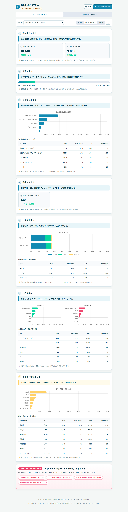
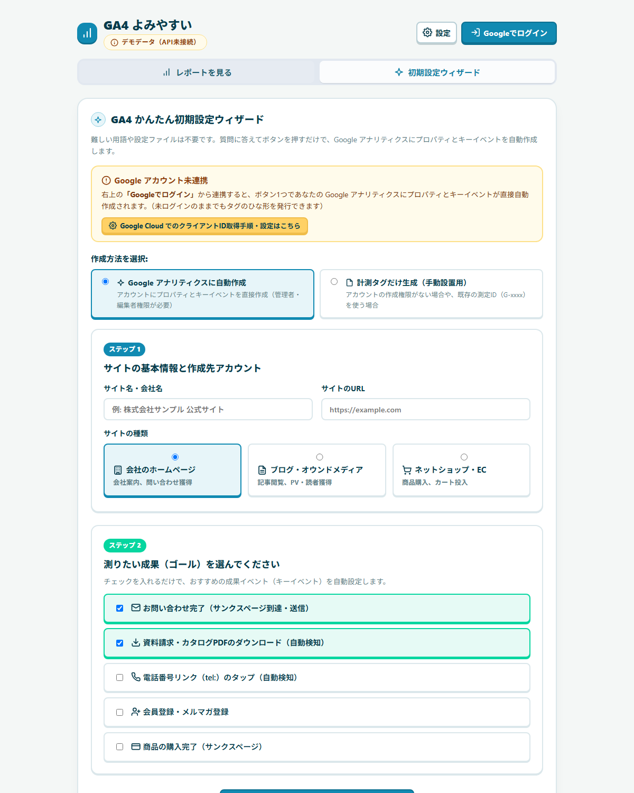

# GA4 よみやすい (GA4 Yomiyasui)

[](https://nyattoh.github.io/ga4-yomiyasui/)
[](LICENSE)
[](#-api-の利用料金について完全無料クレカ不要)

GA4 の難解な指標やレポート画面を平易な日本語に翻訳し、「今日どの数字を見ればよいか」の結論を先に示す超軽量・オープンソースのアクセス解析ビューアです。

🌐 **オンライン版（インストール不要ですぐ試せます）:**  
**[https://nyattoh.github.io/ga4-yomiyasui/](https://nyattoh.github.io/ga4-yomiyasui/)**

---

## 📸 スクリーンショット

### 1. ダッシュボード画面（7大ブロック＋AIアドバイザー）
トイカラー（Toy Color）のポップで見やすい配色と、SVGアイコンによる直感的なレポート画面です。



### 2. 初期設定ウィザード（自動作成 ＆ タグ発行）
まだGA4を持っていない場合でも、アカウント名を入れるだけでプロパティ作成・ストリーム発行・HTML埋め込みコードのコピーまで1画面で完結します。



---

## 💰 API の利用料金について（完全無料・クレカ不要）

**本ツールで利用する Google API は、完全無料（0円）で利用できます。**

- **クレジットカード登録は一切不要**  
  Google Cloud の請求先アカウント（Billing）を有効化する必要はありません。無料枠のまま利用できます。
- **Google Analytics API の費用は 0 円**  
  レポート取得に利用する `Google Analytics Data API`、初期設定に利用する `Google Analytics Admin API` のいずれも、Google 公式で **無料（利用料金なし）** と定められています。
- **使いすぎによる勝手な課金リスクなし**  
  万が一APIの呼び出し上限（クォータ制限）に達した場合でも、**勝手に課金されることは絶対にありません**。一時的にデータ取得が制限（エラー表示）されるだけで、時間が経てば自動的にリセットされます。

> [!TIP]
> 個人ブログ・中小規模の企業サイト・個人開発ツールなどの通常利用において、無料クォータ上限に達することはまずありません。安心してご利用いただけます。

---

## ✨ 主な特徴

1. **専門用語を平易な日本語に固定**:
   - `sessions` → **回数**（サイトを開いた総回数）
   - `activeUsers` → **人数**（訪れた実人数）
   - `engagementRate` → **見ている割合**（滞在・閲覧した訪問の比率）
   - `keyEvents` → **成果**（目標アクションの達成数）
2. **見る順番を固定（上から読むだけ）**:
   - 「人は来ているか → 見ているか → どこから来たか → 国・地域はどこか → 成果はあるか → どんな端末か → どの OS か」の固定順で上から順に理解できます。
3. **国・地域別レポート**:
   - どの国から、日本国内ならどの都道府県・地域からアクセスされているかを可視化。
4. **AI アドバイザー機能**:
   - Google AI Studio で無料取得できる Gemini API キーを設定すれば、ワンクリックで現状の数値の講評と「次にやるべき具体的なアクション」を自動アドバイス。
5. **結論を自動生成**:
   - スマホとパソコンの利用比率の乖離（5pt以上）からリピート傾向を自動判定。
   - 成果（キーイベント）が 0 件のときは、改善提案ではなく「GA4 側の設定未了」の可能性を親切に案内。
6. **初期設定ウィザード ＆ タグ発行**:
   - プロパティの新規作成はもちろん、作成権限がない場合や既存プロパティをお持ちの場合でも「測定IDからタグだけ発行」「手動測定ID入力」に柔軟に対応。
   - Google API 権限エラー時にも原因と解決策を分かりやすくポップアップ案内。
7. **ゼロビルド・完全サーバレス・高プライバシー**:
   - `npm install` やビルドコマンド不要。Pure Modern CSS + Vanilla JS + Chart.js（CDN 1本）のみで構成。
   - 開発者サーバーや第三者サーバーを一切経由せず、データはお使いのブラウザと Google 間でのみ直接通信されます。

---

## 🚀 使い方

### A. Web 版（GitHub Pages）を使う
**[https://nyattoh.github.io/ga4-yomiyasui/](https://nyattoh.github.io/ga4-yomiyasui/)** にアクセスするだけですぐに使えます。

### B. ローカルで動かす場合
```bash
# リポジトリをクローン
git clone https://github.com/nyattoh/ga4-yomiyasui.git
cd ga4-yomiyasui

# Python 付属の簡易 Web サーバーを起動
python -m http.server 8000
```
ブラウザで `http://localhost:8000` にアクセスします。

---

## 🛠 Google Cloud の設定手順（OAuth クライアントIDの取得）

ご自身のドメインやローカル環境でセルフホストする場合、Google のセキュリティ制約により OAuth クライアント ID の設定が必要です。

1. **[Google Cloud Console](https://console.cloud.google.com/) にアクセス**
2. **プロジェクトを作成**（例: `ga4-yomiyasui`）
3. **API を有効化**
   - 「API とサービス」→「ライブラリ」を開く
   - **Google Analytics Data API** を検索して「有効にする」
   - **Google Analytics Admin API** を検索して「有効にする」
4. **OAuth 同意画面を設定**
   - 「OAuth 同意画面」で「外部」を選択し、アプリ名やメールアドレスを入力
   - スコープに `.../auth/analytics.readonly` および `.../auth/analytics.edit` を追加
5. **認証情報（クライアント ID）を発行**
   - 「認証情報」→「認証情報を作成」→「OAuth クライアント ID」
   - アプリケーションの種類: **ウェブ アプリケーション**
   - 承認済みの JavaScript 生成元: ご自身がホストする URL（例: `http://localhost:8000` や `https://your-domain.com`）
6. **アプリに設定**
   - 発行された `xxx.apps.googleusercontent.com` をコピー
   - 「GA4 よみやすい」の画面右上にある **「⚙ 設定」** を開き、クライアント ID を貼り付けて保存します。

---

## 📁 ファイル構成

```
ga4-yomiyasui/
├── index.html          # マークアップ (セマンティック HTML5, SVG アイコン)
├── style.css           # スタイル (トイカラー配色, モダンCSS Grid/Flexbox)
├── app.js              # ロジック (OAuth認可, API通信, 自動考察生成, Chart.js, ウィザード)
├── demo-data.json      # デモ用モックデータ
├── queries.json        # Data API クエリ定義
├── screenshots/        # README用スクリーンショット
│   ├── dashboard.png   # ダッシュボード画面
│   └── wizard.png      # 初期設定ウィザード画面
├── automation/         # Python CLI自動化ツール（プロパティ・ストリーム作成）
│   ├── src/            # Pythonソースコード
│   ├── tests/          # 単体テスト
│   ├── docs/           # ADR・アーキテクチャドキュメント
│   └── README.md       # CLI使用方法（日本語）
├── LICENSE             # MIT License
└── README.md           # 本書（フロントエンド）
```

---

## 🤖 Python CLI 自動化ツール（Tracking-as-Code）

GA4 のプロパティ・データストリーム・カスタム定義を YAML で宣言し、`plan` / `apply` で差分適用する CLI を `automation/` に同梱しています（プライベートリポジトリ `nyattoh/ga4-setup-automation` の実コードを移植）。

```bash
cd automation
pip install -e ".[dev]"
ga4-sync plan --config config/ga4-config.example.yaml
# 適用は意図したときのみ（本番 GA4 を変更します）
# ga4-sync apply --config your-config.yaml
```

詳細は [automation/README.md](automation/README.md) を参照してください。

---

## 📖 参考リンク（Google 公式ドキュメント）

- [Google Analytics Data API 概要](https://developers.google.com/analytics/devguides/reporting/data/v1/quickstart)
- [Google Analytics Admin API 概要](https://developers.google.com/analytics/devguides/config/admin/v1)
- [Google Analytics Data API Quotas（割り当て制限）](https://developers.google.com/analytics/devguides/reporting/data/v1/quotas)
- [Google Identity Services (GIS) Web ガイド](https://developers.google.com/identity/oauth2/web/guides/overview)

---

## 📄 ライセンス

[MIT License](LICENSE)
